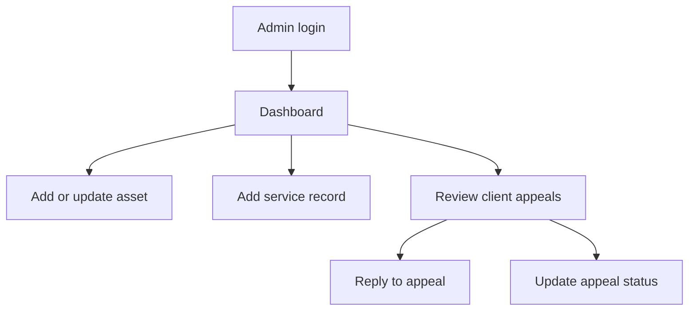
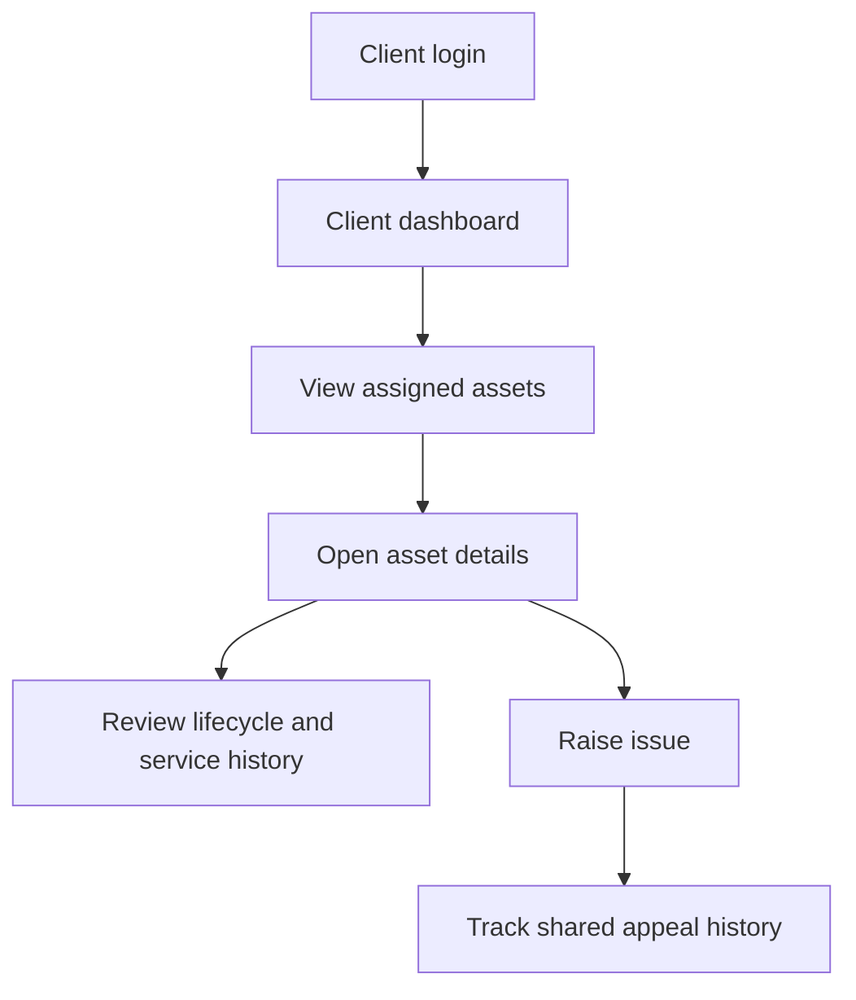
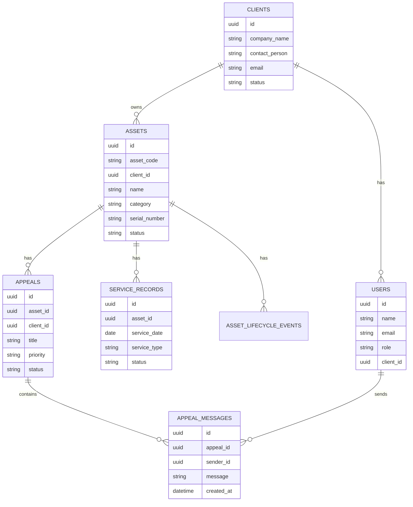

# MVP Architecture

## Product Goal

The HAAK INFOTECH Asset Management PWA centralizes asset records, service history, lifecycle changes, asset images, and issue appeals so admins and clients share the same operational history.

## User Flows

### Admin

### Client

## Data Model

## Production Backend Target

Recommended backend stack:

- Node.js with NestJS or Express
- PostgreSQL
- Prisma ORM
- Secure HTTP-only cookie sessions or JWT with refresh rotation
- Object storage for images and documents
- Role-based and tenant-scoped authorization
- Audit logs for asset, service, and appeal mutations

## API Contract Target

- `POST /api/auth/admin/login`
- `POST /api/auth/client/login`
- `POST /api/auth/logout`
- `GET /api/auth/me`
- `GET /api/assets`
- `POST /api/assets`
- `PATCH /api/assets/:id`
- `GET /api/assets/:id/service-records`
- `POST /api/assets/:id/service-records`
- `GET /api/appeals`
- `POST /api/appeals`
- `GET /api/appeals/:id`
- `PATCH /api/appeals/:id/status`
- `POST /api/appeals/:id/messages`

## Security Requirements For Production

- Clients must only read assets and appeals linked to their `client_id`.
- Admin actions should be permission-gated.
- Passwords must be hashed with Argon2 or bcrypt.
- File uploads need type, size, and malware checks.
- Offline caches must avoid long-lived sensitive data unless encrypted or scoped.
- Appeal history should be public to both parties unless explicitly marked as an internal admin note.
- Audit logs should record who changed assets, statuses, services, and appeals.
